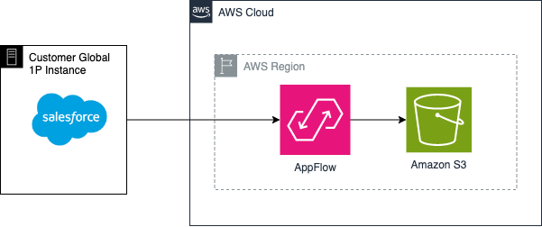

## Use-case
--------------------------------------
This Sample Describes API Connection from Amazon AppFlow to Salesforce, and exports data to Amazon S3. 

## Prerequisites
--------------------------------------

- An AWS Account that will be used to run the [Amazon AppFlows](https://aws.amazon.com/appflow/) Flows, store the Data in [Amazon S3](https://aws.amazon.com/pm/serv-s3/?gclid=Cj0KCQjwgJyyBhCGARIsAK8LVLMxHJ_mpECi2NPYQ3rX9NZmMo9N5eiwI5iIOWRGtsUAwFreODqHx7saAjaFEALw_wcB&trk=fecf68c9-3874-4ae2-a7ed-72b6d19c8034&sc_channel=ps&ef_id=Cj0KCQjwgJyyBhCGARIsAK8LVLMxHJ_mpECi2NPYQ3rX9NZmMo9N5eiwI5iIOWRGtsUAwFreODqHx7saAjaFEALw_wcB:G:s&s_kwcid=AL!4422!3!536452728638!e!!g!!amazon%20s3!11204620052!112938567994) bucket
- Amazon Appflow connection to [Salesforce] (https://www.salesforce.com/) with Change Data Capture feature enabled and properly configured  
- [Terraform v1.4.5](https://releases.hashicorp.com/terraform/1.4.5/) or later installed 

## Architecture
--------------------------------------



## Terraform Resources

## Commands

Run the the following Terraform Commands to deploy the resources

```
terraform init
terraform plan
terraform apply
```

## Providers
--------------------------------------

| Name | Version |
|------|---------|
| <a name="provider_aws"></a> [aws](#provider\_aws) | 5.46.0 |
| <a name="provider_aws.central"></a> [aws.central](#provider\_aws.central) | 5.46.0 |

## Resources
--------------------------------------

| Name | Type |
|------|------|
| [aws_appflow_flow.test_flow](https://registry.terraform.io/providers/hashicorp/aws/latest/docs/resources/appflow_flow) | resource |
| [aws_s3_bucket.appflow_target_bucket](https://registry.terraform.io/providers/hashicorp/aws/latest/docs/resources/s3_bucket) | resource |
| [aws_s3_bucket_acl.source_bucket_acl](https://registry.terraform.io/providers/hashicorp/aws/latest/docs/resources/s3_bucket_acl) | resource |
| [aws_s3_bucket_ownership_controls.s3_bucket_acl_ownership](https://registry.terraform.io/providers/hashicorp/aws/latest/docs/resources/s3_bucket_ownership_controls) | resource |
| [aws_s3_bucket_policy.appflow_target_bucket_s3_policy](https://registry.terraform.io/providers/hashicorp/aws/latest/docs/resources/s3_bucket_policy) | resource |
| [aws_s3_bucket_versioning.target_bucket_versioning](https://registry.terraform.io/providers/hashicorp/aws/latest/docs/resources/s3_bucket_versioning) | resource |
| [aws_iam_policy_document.s3_policy_target_bucket](https://registry.terraform.io/providers/hashicorp/aws/latest/docs/data-sources/iam_policy_document) | data source |

## Inputs
--------------------------------------

| Name | Description | Type | Default | Required |
|------|-------------|------|---------|:--------:|
| <a name="input_customer"></a> [customer](#input\_customer) | Customer Target PoC | `string` | n/a | yes |
| <a name="input_sfdc_connection_name"></a> [sfdc\_connection\_name](#input\_sfdc\_connection\_name) | AppFlow connector name | `string` | n/a | yes |

## Outputs
--------------------------------------

| Name | Description |
|------|-------------|
| <a name="output_flow_arn"></a> [flow\_arn](#output\_flow\_arn) | n/a |

## Security
--------------------------------------

See [CONTRIBUTING](CONTRIBUTING.md) for more information.

## License
--------------------------------------

This library is licensed under the MIT-0 License. See the [LICENSE](LICENSE) file.
