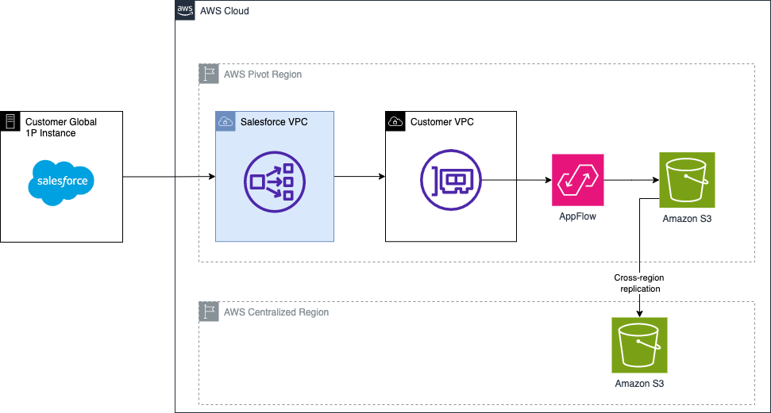

## Use-case
--------------------------------------
Some customers may need to connect privately to Salesforce using [Private Connect feature](https://help.salesforce.com/s/articleView?id=sf.private_connect_overview.htm&type=5) in an AWS Region that is [not supported by Salesforce](https://help.salesforce.com/s/articleView?id=sf.private_connect_considerations.htm&type=5). This sample describes a workaround to this limitation. It establishes Private connection from Amazon AppFlow to Salesforce on a supported AWS Region (Pivot Region) exporting Data on Amazon S3. Then, Data is going to be replicated to an Amazon S3 Bucket in the desired AWS Region. There are multiples ways to replicate Data from one Amazon S3 Bucket to another. For this sample We replicate Data using [S3 Cross-Region replication](https://docs.aws.amazon.com/AmazonS3/latest/userguide/replication.html#crr-scenario)

## Prerequisites
--------------------------------------

- An AWS Account that will be used to run the [Private Amazon AppFlows flows](https://docs.aws.amazon.com/appflow/latest/userguide/private-flows.html) and store the Data in [Amazon S3 on the pivot region](https://aws.amazon.com/pm/serv-s3/?gclid=Cj0KCQjwgJyyBhCGARIsAK8LVLMxHJ_mpECi2NPYQ3rX9NZmMo9N5eiwI5iIOWRGtsUAwFreODqHx7saAjaFEALw_wcB&trk=fecf68c9-3874-4ae2-a7ed-72b6d19c8034&sc_channel=ps&ef_id=Cj0KCQjwgJyyBhCGARIsAK8LVLMxHJ_mpECi2NPYQ3rX9NZmMo9N5eiwI5iIOWRGtsUAwFreODqHx7saAjaFEALw_wcB:G:s&s_kwcid=AL!4422!3!536452728638!e!!g!!amazon%20s3!11204620052!112938567994) bucket.
- Amazon Appflow connection to [Salesforce] (https://www.salesforce.com/) with Change Data Capture feature enabled and properly configured. 
- AWS Regions to be used as Pivot and Centralized  
- Additionally, check [Salesforce private connect](https://help.salesforce.com/s/articleView?id=sf.private_connect_overview.htm&type=5) prerequisites. Make sure that Private connect feature is supported and provisioned in your Pivot Region
- [Terraform v1.4.5](https://releases.hashicorp.com/terraform/1.4.5/) or later installed 

## Architecture
--------------------------------------



## Terraform Resources

## Commands

Run the the following Terraform Commands to deploy the resources

```
terraform init
terraform plan
terraform apply
```

## Providers
--------------------------------------

| Name | Version |
|------|---------|
| <a name="provider_aws"></a> [aws](#provider\_aws) | 5.46.0 |
| <a name="provider_aws.central"></a> [aws.central](#provider\_aws.central) | 5.46.0 |
| <a name="provider_aws.pivot"></a> [aws.pivot](#provider\_aws.pivot) | 5.46.0 |

## Resources
--------------------------------------

| Name | Type |
|------|------|
| [aws_appflow_flow.test_flow](https://registry.terraform.io/providers/hashicorp/aws/latest/docs/resources/appflow_flow) | resource |
| [aws_iam_policy.iam_policy_replication](https://registry.terraform.io/providers/hashicorp/aws/latest/docs/resources/iam_policy) | resource |
| [aws_iam_role.iam_role_replication](https://registry.terraform.io/providers/hashicorp/aws/latest/docs/resources/iam_role) | resource |
| [aws_iam_role_policy_attachment.iam_policy_attachment_replication](https://registry.terraform.io/providers/hashicorp/aws/latest/docs/resources/iam_role_policy_attachment) | resource |
| [aws_s3_bucket.bucket_centralized](https://registry.terraform.io/providers/hashicorp/aws/latest/docs/resources/s3_bucket) | resource |
| [aws_s3_bucket.bucket_pivot](https://registry.terraform.io/providers/hashicorp/aws/latest/docs/resources/s3_bucket) | resource |
| [aws_s3_bucket_acl.source_bucket_acl](https://registry.terraform.io/providers/hashicorp/aws/latest/docs/resources/s3_bucket_acl) | resource |
| [aws_s3_bucket_ownership_controls.s3_bucket_acl_ownership](https://registry.terraform.io/providers/hashicorp/aws/latest/docs/resources/s3_bucket_ownership_controls) | resource |
| [aws_s3_bucket_policy.pivot_s3_policy](https://registry.terraform.io/providers/hashicorp/aws/latest/docs/resources/s3_bucket_policy) | resource |
| [aws_s3_bucket_replication_configuration.replication](https://registry.terraform.io/providers/hashicorp/aws/latest/docs/resources/s3_bucket_replication_configuration) | resource |
| [aws_s3_bucket_versioning.bucket_centralized_versioning](https://registry.terraform.io/providers/hashicorp/aws/latest/docs/resources/s3_bucket_versioning) | resource |
| [aws_s3_bucket_versioning.bucket_pivot_versioning](https://registry.terraform.io/providers/hashicorp/aws/latest/docs/resources/s3_bucket_versioning) | resource |
| [aws_iam_policy_document.assume_role](https://registry.terraform.io/providers/hashicorp/aws/latest/docs/data-sources/iam_policy_document) | data source |
| [aws_iam_policy_document.replication](https://registry.terraform.io/providers/hashicorp/aws/latest/docs/data-sources/iam_policy_document) | data source |
| [aws_iam_policy_document.s3_policy_pivot_bucket](https://registry.terraform.io/providers/hashicorp/aws/latest/docs/data-sources/iam_policy_document) | data source |
| [aws_kms_key.s3_key](https://registry.terraform.io/providers/hashicorp/aws/latest/docs/data-sources/kms_key) | data source |

## Inputs
--------------------------------------

| Name | Description | Type | Default | Required |
|------|-------------|------|---------|:--------:|
| <a name="input_customer"></a> [customer](#input\_customer) | Customer Target PoC | `string` | n/a | yes |
| <a name="input_encryption_key_central_region"></a> [encryption\_key\_central\_region](#input\_encryption\_key\_central\_region) | Encryption key in central region | `string` | n/a | yes |
| <a name="input_metric_replication_minutes"></a> [metric\_replication\_minutes](#input\_metric\_replication\_minutes) | The time in minutes after which the replication status is published | `number` | `15` | no |
| <a name="input_replication_time_minutes"></a> [replication\_time\_minutes](#input\_replication\_time\_minutes) | The time in minutes within which Amazon S3 must replicate objects | `number` | `15` | no |
| <a name="input_sfdc_connection_name"></a> [sfdc\_connection\_name](#input\_sfdc\_connection\_name) | AppFlow connector name | `string` | n/a | yes |

## Outputs
--------------------------------------

| Name | Description |
|------|-------------|
| <a name="output_flow_arn"></a> [flow\_arn](#output\_flow\_arn) | n/a |

## Security
--------------------------------------

See [CONTRIBUTING](CONTRIBUTING.md) for more information.

## License
--------------------------------------

This library is licensed under the MIT-0 License. See the [LICENSE](LICENSE) file.
