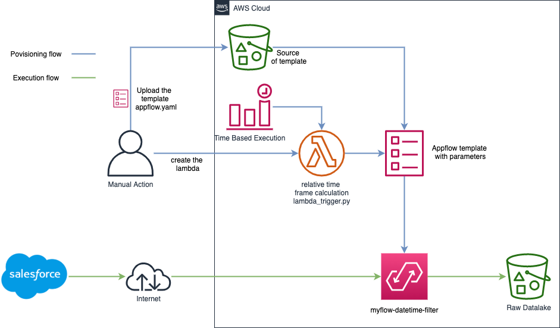

# Amazon AppFlow Relative Time Frame Automation Example

This repository contains an example of project for the [Amazon AppFlow Service](https://github.com/aws-samples/amazon-appflow).

## Table of Contents
1. [About this Project](#About)
2. [Arquitecture](#Architecture)
3. [Pre Requirements](#Prereq)
4. [How to use this](#Howto)
5. [License](#License)

## About this project 

To run an AWS Cloudformation template to create an Amazon AppFlow flow with and specific time field for time filtering is necessary pass an start date and an end date in EPOCH UNIX format, so this project bring an example of how to do this calculation in a dynamic way with a Python (AWS Lambda) code example to calculate a range of date in a relative way (# days) and pass this to a cloudformation to create a full charge flow in Amazon Appflow with the calculated time frame in epoch format to get data from salesforce and put it into Amazon S3.

Relative Time Frame means express a range of time in days, weeks, months instead of use an start date and end date.

# Architecture 

   

# Pre Requirements 

Those are the following pre requisits you have made to use this example. 

1. Create two AWS S3 buckets, one to store the cloudformation template and other as a raw layer of your datalake.
2. Create a Salesforce Amazon AppFlow connection. 
3. Add a bucket policy in the bucket configuration to allow the write for Amazon AppFlow Service.
4. You must edit the AWS Cloudformation template to modify the table and the quantity of fields that you want to retrieve from Salesforce. by the default, the AWS Cloudformation template sample retrieve the "OrderItem" table and the following fields:
	 - Id
     - Product2Id
     - IsDeleted
     - OrderId
     - PricebookEntryId
     - OriginalOrderItemId
     - AvailableQuantity
     - Quantity
     - UnitPrice
     - TotalPrice
     - ListPrice
     - ServiceDate
     - EndDate
     - Description
     - LastModifiedDate
     - CreatedById
     - CreatedDate

# How to Use It 

  1. Step One: Upload the AWS Cloudformation template appflow.yml to an S3 bucket. 

  2. Step Two: Create a lambda IAM Role with the Amazon S3 Read Only Access and AWS Cloudformation Full Access permissions to allow the Lambda function to read the AWS Cloudformation template located in Amazon S3 and launch the AWS Cloudformation Stack.

  3. Step Three: Create a AWS Lambda function with the following configuration:
  	 - Runtime: Python 3.6
  	 - Handler: index.handler
  	 - Memory: 128
  	 - Timeout: 1 min

  4. Step Four: You also must configure four environment variables in the AWS Lambda function:

  	 - connName : The value is the Amazon AppFlow Salesforce connection name. (Example: aws95-dev-ed)
  	 - templateUrl : The Value is the AWS Cloudformation template for Amazon S3 bucket URL. (Example: https://s3-external-1.amazonaws.com/cf-templates-105b6q2gor9b3-us-east-1/2021052SSZ-new.template22efnvt9sqah)
  	 - timeField : The field in Salesforce schema to filter the data. (Example: CreatedDate)
  	 - bucketName : Bucket Name to write the data by Amazon Appflow ingestion. (Example: my-bucket-name)
  	 - numPastDays: Are the quantity of days you want retrieve the full data. If you put three meas that the AWS Lambda function will calculate the start date the 00:00 hours of the 3th day in the past the script includes the data of the day when you are launching the process. (Example: 3) 

  5. Step Five: Schedule using Amazon Cloudwatch events or run manually the Flow to have the data ingested to Amazon S3.

# License 

This sample is licensed under the MIT-0 License.
