## Create a Salesforce developer account, and export using AppFlow

Amazon AppFlow is a fully managed integration service that enables customers to securely transfer data between AWS services and software-as-a-service (SaaS) applications in just a few clicks. [Amazon AppFlow now supports automatic import of newly created Salesforce fields into Amazon S3 without requiring the user to update their flow configurations](https://aws.amazon.com/about-aws/whats-new/2020/07/amazon-appflow-supports-new-salesforce-integrations/). Also, Amazon AppFlow now allows users to import deleted records from Salesforce to any supported destination.

Following are the steps needed to create a connection to salesforce to extract the object, _**Account**_, and store in S3 bucket in JSON format.

1. Create a free developer account at [developer.salesforce.com](https://developer.salesforce.com)
    
    1. If you have a salesforce account connected with your organization email, signed up with an email like username+sfdev@orgdomain.com
    2. Even though you use a new email, oddly enough your email notifications for new signup still would go to org email

2. Login to the developer account using the [url](https://login.salesforce.com) using the newly created credential.
3. Log on to AWS Console, navigate to Amazon AppFlow Service, expand the left pane to click on _**Connections**_ as shown below.
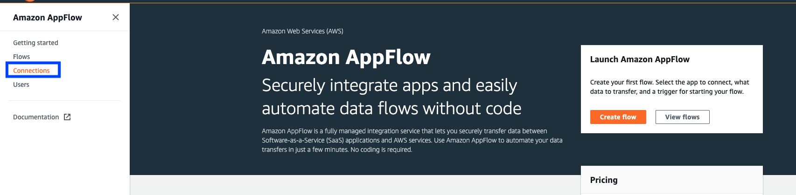

4. From the drop-down of connectors select _**Salesforce**_ and click on _**Create connection**_ to get started on creating a new connection.
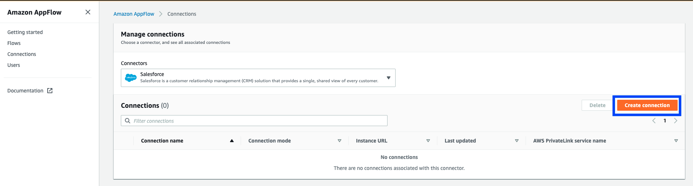

5. Enter _**Salesforce environment**_. Since the target is S3, disable PrivateLink, enter _**Connection name**_ and click _**Continue**_.
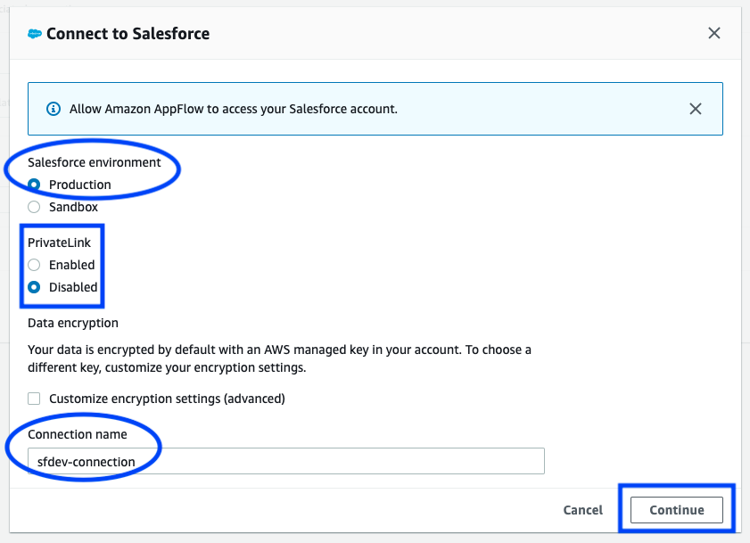

6. Click _**Allow**_ to proceed further
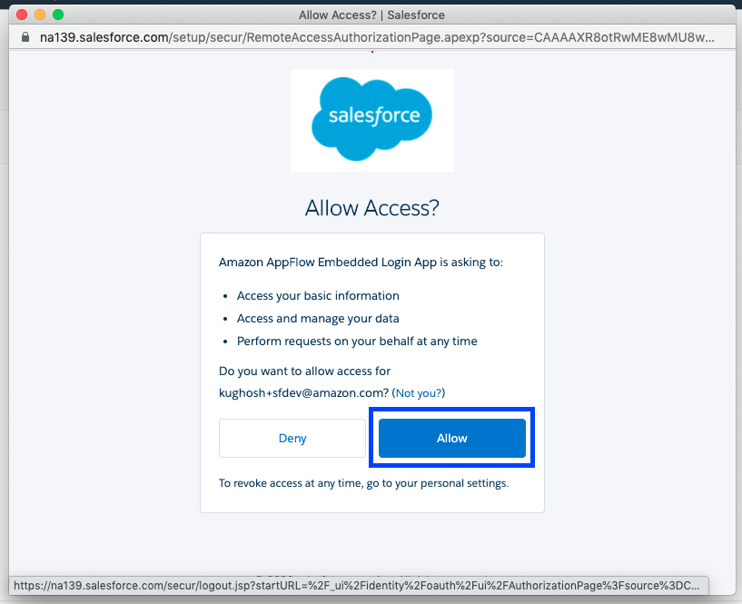

7. The Salesforce connection is created as shown below.
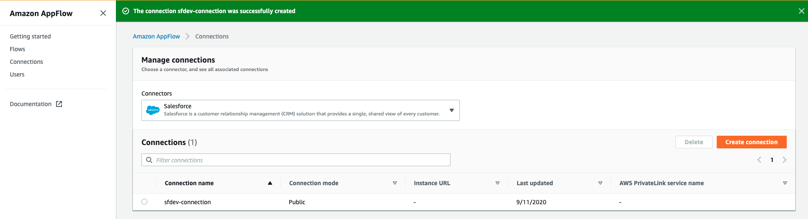

8. Create a private s3 bucket in the same region as the AppFlow as I created the s3 bucket named _**appflow-sfdev**_.

9. Go back to the AppFlow console and click on _**Create flow**_ to create a flow.
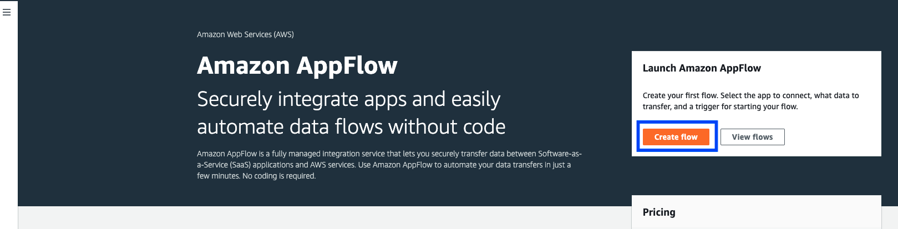

10. The first step is to specify specify flow details and hence enter _**Flow name**_, _**Flow description**_ and click _**Next**_.
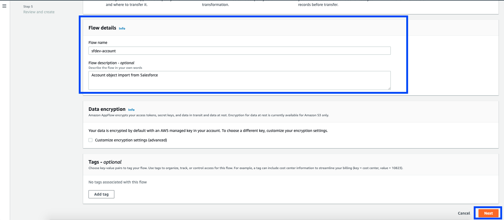

11. Specify the _**Source name**_ as Salesforce, connection as created earlier, and pick the _**Salesforce objects**_ to import.
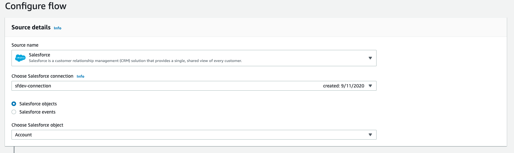

12. Enter _**Destination details**_ by picking Amazon S3 as the _**Destination name**_, pick the bucket name created earlier and enter the _**Flow trigger**_ to _**Run on demand**_ and then click _**Next**_.
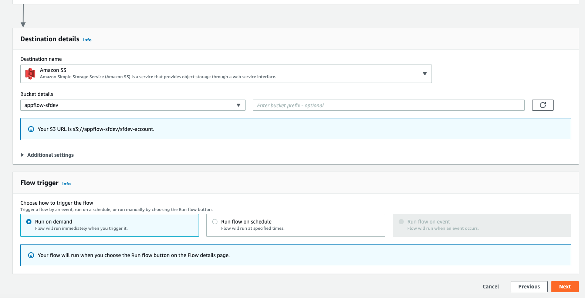

13. For the _**Mapping method**_ choose to _**Manually map fields**_. For the _**Source to destination field mapping**_ chose the _**Map all fields directly**_ under _**Bulk actions**_ and click _**Next**_.
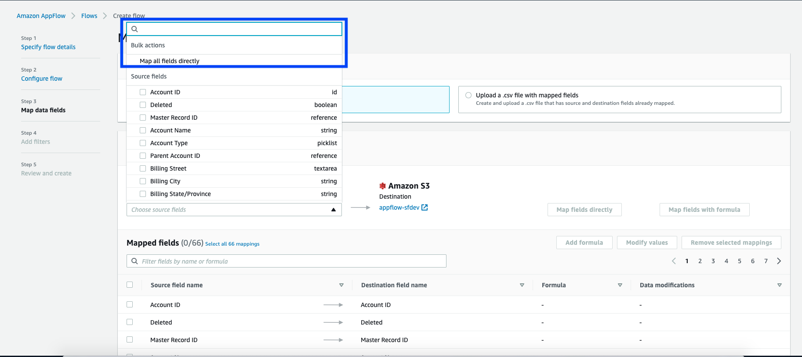

14. Click _**Next**_ to get past the _**Add filters**_ section, finally get to the “Review and create” step, scroll down to click on _**Create flow**_ to materialize the flow creation.
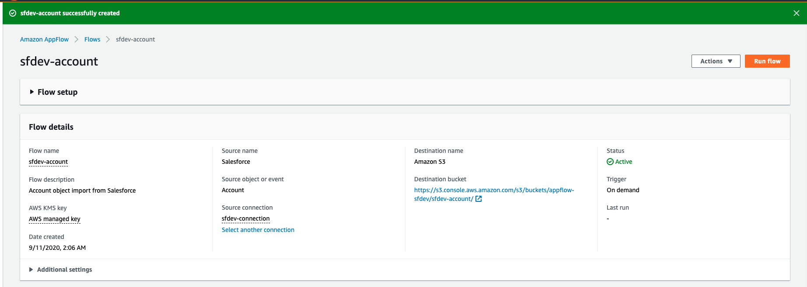

