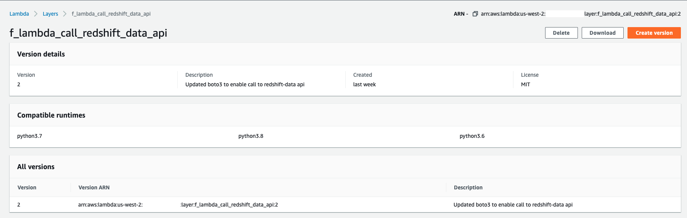
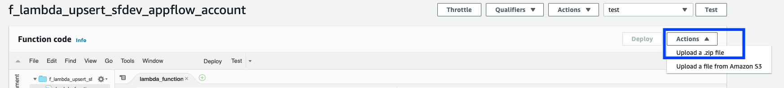
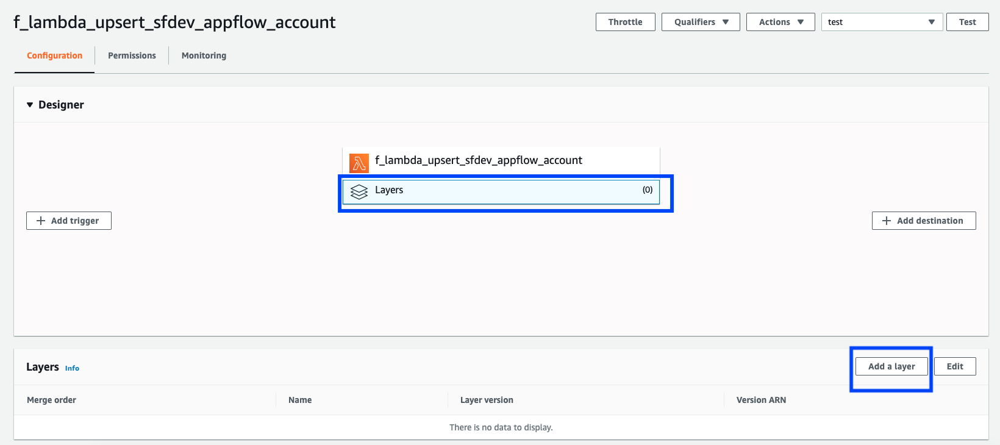
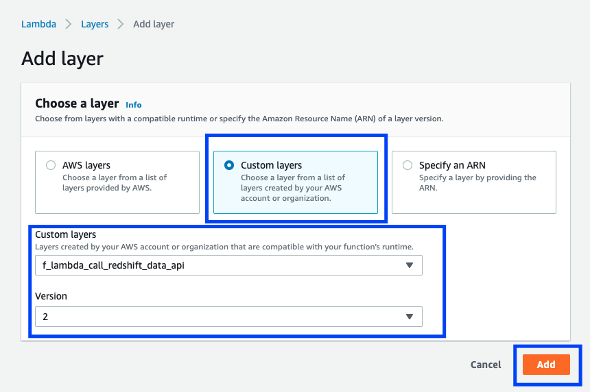
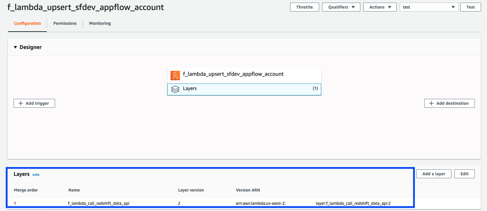
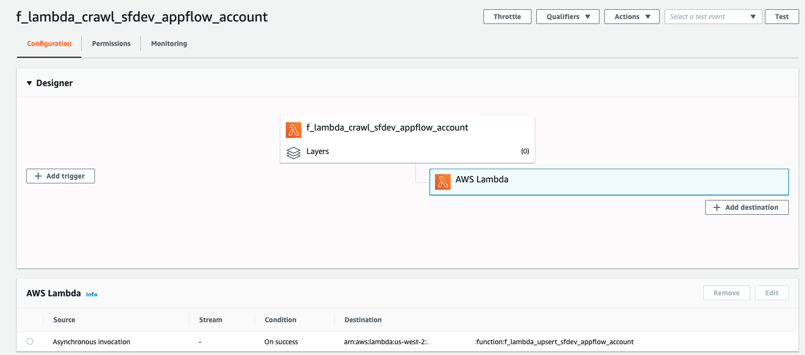
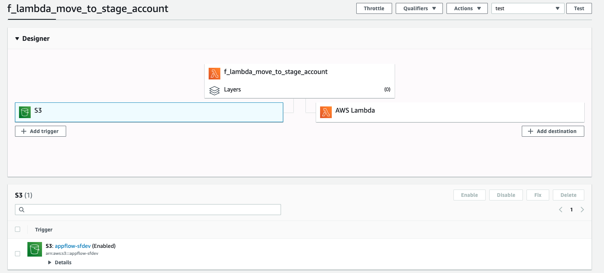
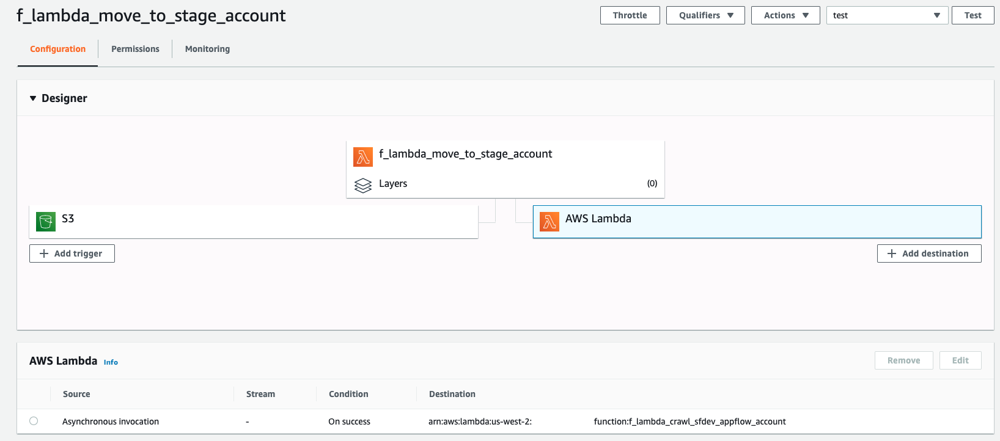

## Create Lambda functions along with layers and destination

[AWS Lambda](https://aws.amazon.com/lambda/) lets you run code without provisioning or managing servers. You pay only for the compute time you consume. You can configure your Lambda function to pull in additional code and content in the form of layers also know as [AWS Lambda layers](https://docs.aws.amazon.com/lambda/latest/dg/configuration-layers.html)

We will be using Lambda as an s3 event trigger to move _**Account**_ data file to data lake stage, also to trigger the Glue crawler to crawl the data to update the metadata in Glue catalog, and finally calling redshift data API to upsert to redshift target tables.

1. Create a Lambda layer to make the latest version of boto3 available to use [redshift-data](https://boto3.amazonaws.com/v1/documentation/api/latest/reference/services/redshift-data.html) API.
    1. From the AWS console navigate to AWS Lambda console, and click on _**Layers**_ under _**Additional resources**_. Click on _**Create layer**_. 
    2. Name the layer, _**f_lambda_call_redshift_data_api**_ with an appropriate description, upload [f_lambda_call_redshift_data_api.zip](lambda/layers/f_lambda_call_redshift_data_api.zip), choose Python 3 and MIT as _**Compatible runtimes**_ and _**License**_ respectively. 
    3. Click on _**Create**_ to create the layer as I created the layer, _**f_lambda_call_redshift_data_api**_ as shown below.
    

2. Follow the guidance in section _**To create an execution role**_ in [Building Lambda functions with Python](https://docs.aws.amazon.com/lambda/latest/dg/lambda-python.html) to create a lambda execution role. Just like I created an all permissive _**Lambda_Admin**_ role as shown below.

3. Follow the guidance in the section _**To create a Python function**_ [Building Lambda functions with Python](https://docs.aws.amazon.com/lambda/latest/dg/lambda-python.html) to create 3 lambda functions as below. _**Click on the Advanced settings to select the VPC we created earlier**_.
    1. _**f_lambda_upsert_sfdev_appflow_account**_  -   In the _**Function code**_ section click on _**Actions**_ to upload the zip file, [f_lambda_upsert_sfdev_appflow_account.zip](lambda/functions/f_lambda_upsert_sfdev_appflow_account.zip)
    
    2. _**f_lambda_crawl_sfdev_appflow_account**_   -   In the _**Function code**_ section click on _**Actions**_ to upload the zip file, [f_lambda_crawl_sfdev_appflow_account.zip](lambda/functions/f_lambda_crawl_sfdev_appflow_account.zip)
    3. _**f_lambda_move_to_stage_account**_         -   In the _**Function code**_ section click on _**Actions**_ to upload the zip file, [f_lambda_move_to_stage_account.zip](lambda/functions/f_lambda_move_to_stage_account.zip)

**Change the _**new_bucket_name**_ variable value to appropriate data lake bucket name as you created in step 3 of [Create_VPC_S3_Glue](Create_VPC_S3_Glue.md) in the lambda function, _**f_lambda_move_to_stage_account**_**

4. Select the _**Layers**_ of the lambda function, _**f_lambda_upsert_sfdev_appflow_account**_, and click on _**Add a layer**_. In the next screen choose the latest version of the _**Custom layers**_ named _**f_lambda_call_redshift_data_api**_ created earlier as shown below.

5. Add the lambda function _**f_lambda_upsert_sfdev_appflow_account**_ as the destination for lambda function, _**f_lambda_crawl_sfdev_appflow_account**_ selecting the _**Source**_ as _**Asynchronous invocation**_, and _**Condition**_ as _**On success**_ as shown below.

6. Add an S3 trigger to lambda function, _**f_lambda_move_to_stage_account**_ for any object created in bucket named _**appflow-sfdev**_, and _**Prefix**_, _**sfdev-account/**_ as shown below.

7. Add the lambda function _**f_lambda_crawl_sfdev_appflow_account**_ as the destination for lambda function, _**f_lambda_move_to_stage_account**_ selecting the _**Source**_ as _**Asynchronous invocation**_, and _**Condition**_ as _**On success**_ as shown below.

