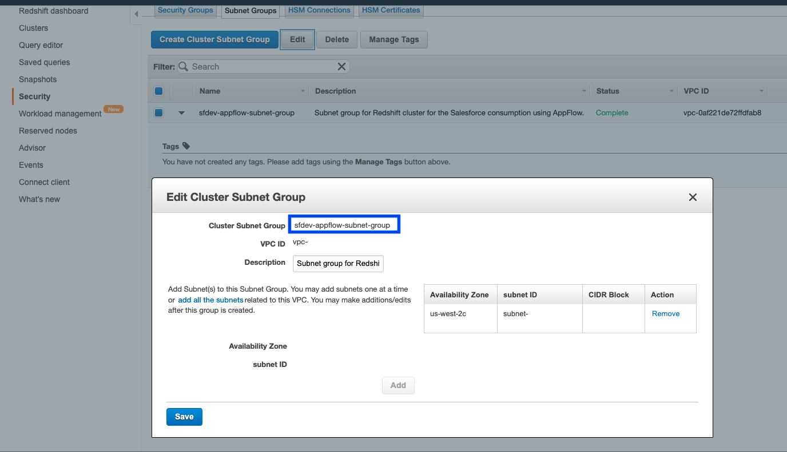
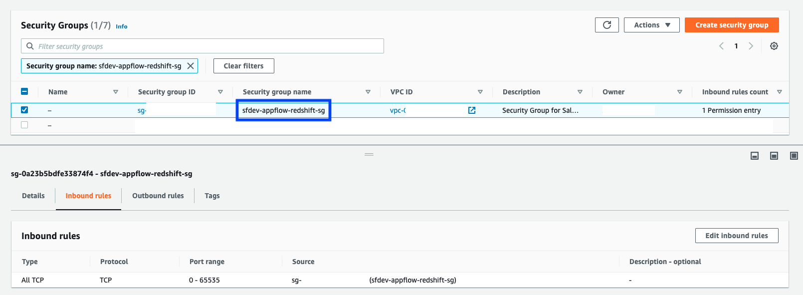
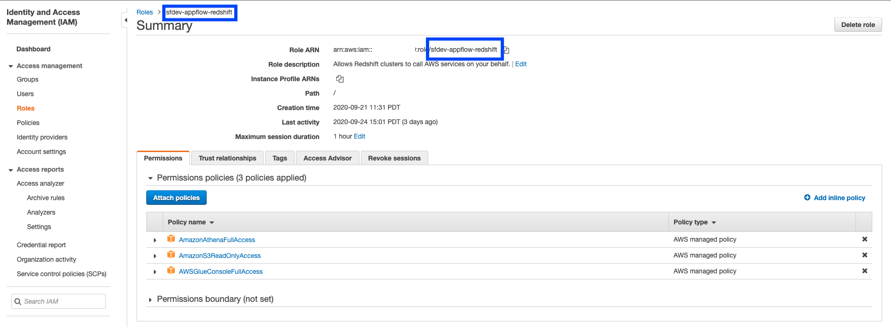
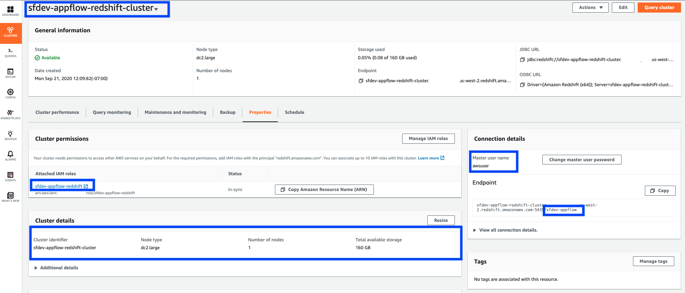
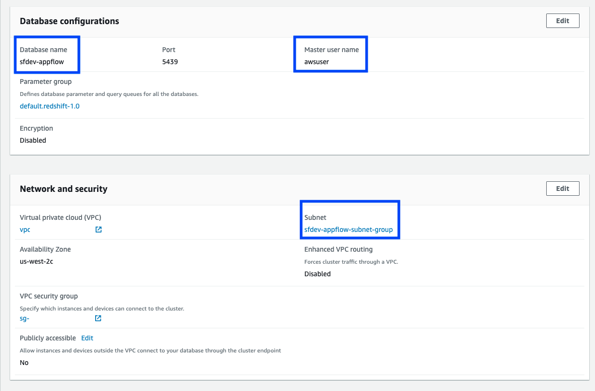
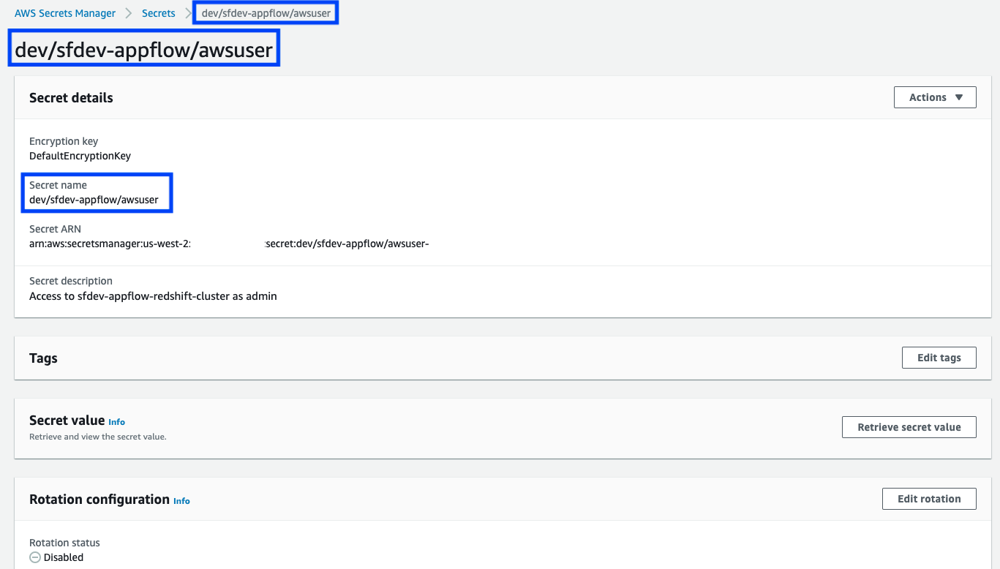

## Create Redshift Cluster in private subnet along with all database objects

[Amazon Redshift](https://aws.amazon.com/redshift/) is the most popular and fastest cloud data warehouse. [Amazon AppFlow does support Amazon Redshift as a destination](https://docs.aws.amazon.com/appflow/latest/userguide/requirements.html#redshift) but AppFlow still cannot connect to Redshift in private subnet. Curstomers almost always create a data warehouse in the private subnet for security reasons. 

Redshift cluster will be created in the private subnet of the VPC we created earlier. Also AWS Glue would need access to the Redshift cluster. Also an IAM role is required for Redshift and Redshift Spectrum.

1. Create an [Amazon Redshift cluster subnet group](https://docs.aws.amazon.com/redshift/latest/mgmt/working-with-cluster-subnet-groups.html). I created a subnet group named _**sfdev-appflow-subnet-group**_ choosing the VPC and the private subnet created earlier as shown below.

2. Navigate to the VPC console and create a security group for the Redshift Cluster in the VPC we created earlier. [Make sure to add a self referencing inbound rule for ALL TCP for Glue to access the Redshift Cluster](https://docs.aws.amazon.com/glue/latest/dg/connection-JDBC-VPC.html). I created a security group named _**sfdev-appflow-redshift-sg**_ as shown below.

3. Create a Redshift Service IAM role called _**sfdev-appflow-redshift**_ with managed policies like AmazonAthenaFullAccess, AmazonS3ReadOnlyAccess, and AWSGlueConsoleFullAccess as mentioned below. You can follow [Create IAM role for Redshift](https://docs.aws.amazon.com/redshift/latest/gsg/rs-gsg-create-an-iam-role.html), [Create IAM role for Redshift Spectrum](https://docs.aws.amazon.com/redshift/latest/dg/c-getting-started-using-spectrum-create-role.html) for guidance. 

4. Create a redshift cluster in the private subnet of the VPC created earlier using the subnet group, security group, and the IAM role created above. Follow the link to a [Sample Amazon Redshift Cluster](https://docs.aws.amazon.com/redshift/latest/gsg/rs-gsg-launch-sample-cluster.html). I created a cluster with an id, _**sfdev-appflow-redshift-cluster**_ with DB name, _**sfdev-appflow**_, and user name, _**awsuser**_

5. Log on to the AWS Console and navigate to Redshift to use the inbuilt query editor to the run the following SQLs to create necessary schemas and tables.
    1. Run [create_schema_ext_sfdev_appflow.sql](sqls/create_schema_ext_sfdev_appflow.sql) to create an external schema _**ext_sfdev_appflow**_ using the AWS Glue catalog DB, _**sfdev-appflow**_ 
    2. Run [create_stage_target_schema.sql](sqls/create_stage_target_schema.sql) to create stage, and target schemas.
    3. Run [create_stage_target_table.sql](sqls/create_stage_target_table.sql) to create the stage, and target tables.

6. Navigate to [AWS Secrets Manager](https://aws.amazon.com/secrets-manager/), click on _**Store a new secret**_ to _**Select secret type**_ as _**Credentials for Redshift cluster**_, enter _**User name**_, _**Password**_, select the cluster id created above, and click _**Next**_. Enter a _**Secret name**_ and click _**Next**_. _**Disable automatic rotation**_ and click _**Next**_ to review. Finally click on _**Store**_ to save the secret. As I created the _**Secret name**_, _**dev/sfdev-appflow/awsuser**_ as shown below.
