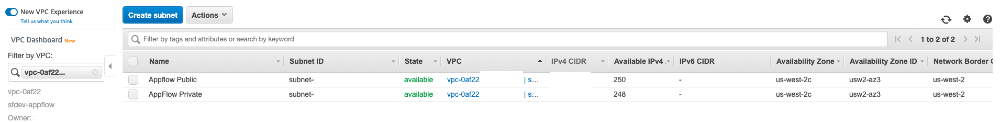
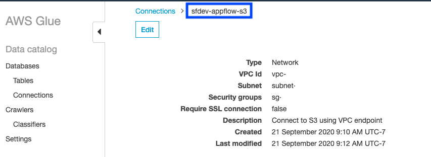
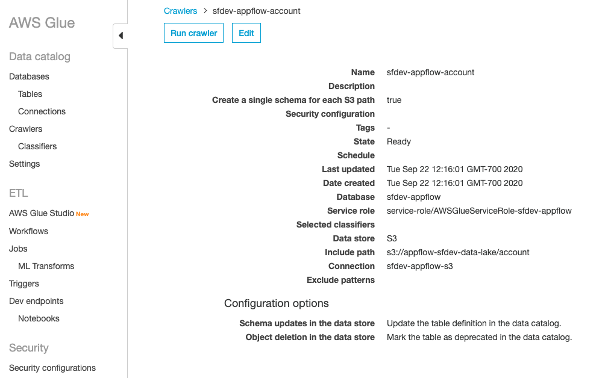

## Create VPC, S3, Glue

In order to secure all the resource created, create a VPC with private subnet, vpc endpoint for S3 in order to prevent the traffic from going over the public internet. Finally the AWS Glue crawler will be crawl the _**Account**_ data extract from the data lake to update the Glue catalog.

1. [Amazon Virtual Private Cloud (Amazon VPC)](https://aws.amazon.com/vpc/) lets you provision a logically isolated section of the AWS Cloud where you can launch AWS resources in a virtual network that you define. You have complete control over your virtual networking environment, including selection of your own IP address range, creation of subnets, and configuration of route tables and network gateways. In order to create a secure data platform customers almost always create it in a private subnet. Follow the tutorial : [Creating a VPC with Public and Private Subnets for Your Compute Environments](https://docs.aws.amazon.com/batch/latest/userguide/create-public-private-vpc.html) to create a VPC with public and private subnets.

    
2. A [VPC endpoint](https://docs.aws.amazon.com/vpc/latest/userguide/endpoint-services-overview.html) enables you to privately connect your VPC to supported AWS services and VPC endpoint services powered by AWS PrivateLink without requiring an internet gateway, NAT device, VPN connection, or AWS Direct Connect connection. Instances in your VPC do not require public IP addresses to communicate with resources in the service. Traffic between your VPC and the other service does not leave the Amazon network. [Create Amazon VPC Endpoints for Amazon S3](https://docs.aws.amazon.com/glue/latest/dg/vpc-endpoints-s3.html) inorder to make sure that the data does not travel over the public internet. You can also follow the [blog to create a VPC Endpoint for Amazon S3](https://aws.amazon.com/blogs/aws/new-vpc-endpoint-for-amazon-s3/).

3. Create an S3 bucket to denote your data lake in the same region as the AppFlow resources created in the previous section. For example the S3 bucket called _**appflow-sfdev-data-lake**_ as shown below.

  
4. Navigate to the AWS Glue console and click on _**Databases**_ from the left pane, click on _**Add database**_ to type a name of the database to create an [AWS Glue database](https://docs.aws.amazon.com/glue/latest/dg/define-database.html). In my case I named it _**sfdev-appflow**_.

5. Click on _**Connections**_ from the left pane in the AWS Glue console and then click on _**Add connection**_ to create a connection for S3 using the VPC, private subnet, default subnet, S3 endpoint crated earlier. You can also follow [Crawling an Amazon S3 Data Store using a VPC Endpoint](https://docs.aws.amazon.com/glue/latest/dg/connection-S3-VPC.html) for reference. I named the connection _**sfdev-appflow-s3**_ as shown below. 

6. Click on _**Crawlers**_ from the left pane in the AWS Glue console and then click on _**Add crawler**_ to create a crawler using _**sfdev-appflow-s3**_ as connection, _**sfdev-appflow**_ as database, _**s3://unique-bucket-name/account**_ as the s3 path. Replace _**unique-bucket-name**_ with the bucket name created in step 3. Also create an IAM role as needed. You can also follow [Crawling an Amazon S3 Data Store using a VPC Endpoint](https://docs.aws.amazon.com/glue/latest/dg/connection-S3-VPC.html) for reference. Named the crawler _**sfdev-appflow-account**_ as shown below. 

