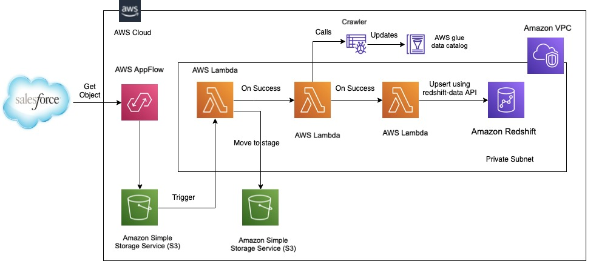

## Extract salesforce data using Amazon AppFlow and upsert it to Redshift tables hosted on private subnet using data APIs

[Amazon AppFlow](https://aws.amazon.com/appflow/) is a fully managed integration service that enables you to securely transfer data between Software-as-a-Service (SaaS) applications like Salesforce, Marketo, Slack, and ServiceNow, and AWS services like Amazon S3 and Amazon Redshift, in just a few clicks. Most customers would run their Redshift cluster in their private subnet hence AppFlow would not be able to load data to the Redshift cluster running in private subnet. Additionally you may also want to upsert data to your Data Warehouse or Redshift Cluster as opposed to just insert. 

Here we show you how to extract salesforce objects using Amazon AppFlow, store it in data lake (S3), crawl the dataset using AWS Glue crawler to update the catalog, and call the [redshift-data](https://boto3.amazonaws.com/v1/documentation/api/latest/reference/services/redshift-data.html#client) API to upsert or merge to Redshift tables.

## Scope
Pulling in the _**Account**_ object from salesforce for this demonstration.

## Solution Overview

In order for us to build this solution we first need to create 

* [Salesforce developer account](https://developer.salesforce.com) 
* [AppFlow connection and flow](https://aws.amazon.com/appflow/getting-started/)
* [Create VPC with public and private subnets](https://docs.aws.amazon.com/batch/latest/userguide/create-public-private-vpc.html) to create our own network where we can create the resources.
* [Create Amazon Redshift Cluster in private subnet](https://docs.aws.amazon.com/redshift/latest/gsg/rs-gsg-launch-sample-cluster.html) in the private subnet of the VPC to make sure its not reachable from the internet.
* [Define AWS Glue Crawler](https://docs.aws.amazon.com/glue/latest/dg/add-crawler.html) to crawl the data and update the catalog
* [AWS Lambda functions to be invoked for S3 event](https://docs.aws.amazon.com/lambda/latest/dg/with-s3.html), call AWS Glue crawler, call [data API for Amazon Redshift](https://aws.amazon.com/about-aws/whats-new/2020/09/announcing-data-api-for-amazon-redshift/) to upsert data to Redshift

## Solution Architecture

The following architecture diagram shows how AppFlow can consume Salesforce data to land it on S3. This event will trigger a lambda to move the data to data lake to be crawled by AWS Glue crawler in order to update the metadata in the Glue catalog. The next lambda would execute a query using the data API for Redshift to query the data from data lake using Redshift Spectrum and upsert the data to redshift tables.



*Please note that although [Amazon AppFlow does support Amazon Redshift as a destination](https://docs.aws.amazon.com/appflow/latest/userguide/requirements.html#redshift) but it still cannot connect to Redshift in private subnet. Customers almost always create a data warehouse in the private subnet for security reasons.*

## Pre-requisites
- [Create AWS Account](https://aws.amazon.com/premiumsupport/knowledge-center/create-and-activate-aws-account/)
- Familiarity with [Amazon AppFlow](https://aws.amazon.com/appflow/), [Amazon S3](https://aws.amazon.com/s3/), [AWS Glue Crawler](https://docs.aws.amazon.com/glue/latest/dg/add-crawler.html), [AWS Lambda](https://aws.amazon.com/lambda/), [Amazon Redshift](https://aws.amazon.com/redshift/)

----

#### 1. [Create a Salesforce developer account and extract data using AppFlow](AppFlow_extract_from_Salesforce.md)

----

#### 2. [Create VPC, S3, Glue](Create_VPC_S3_Glue.md)

----

#### 3. [Set up the Redshift Cluster in private subnet](Create_Redshift_Private.md)

----

#### 4. [Create Lambda, its layers, triggers, destination](Create_Lambda_Layers_Triggers_Destination.md)

----

#### 5. Run the flow, sfdev-account.

Before running the flow named _**sfdev-account**_
1. Change the _**new_bucket_name**_ variable value to appropriate data lake bucket name in the lambda function, _**f_lambda_move_to_stage_account**_
2. Log on to the [url](https://login.salesforce.com) with the credentials created earlier, and from the _**Apps**_ search for _**Accounts**_ under _**Items**. Click _**New**_ to create a new account or edit an existing one.

Go back to the Amazon AppFlow console and select the flow named _**sfdev-account**_ and click _**Run flow**_. It will show the run metrics post completion as shown below.


Go back to the Redshift console and select the _**EDITOR**_ to run the below sql to verify that the records got loaded to the redshift table.
```sql
select * from tgt_sfdev_appflow.account;
```

----

## Clean Up

Post testing, clean up all resource created to avoid incurring charges when resources are not in use.

----

## Conclusion

We showed you how you extract Salesforce objects to data lake, and upsert to tables in Redshift tables running in private subnet.
